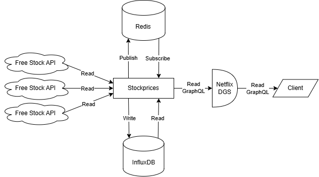

# Stock Prices

Stock Prices must be visible in the frontend. The most common watch lists display charts for the past 5 years, 3 years, 1 year, 1 month and 1 week. For this purpose, only a single stock should be accessed with its history data.

It must also be possible to request the current price of a single stock (so that the Order Service knows the execution price) and to request the current prices of multiple stocks to provide an overview of the tracked stocks in a user's depot.

To achieve this the following backend architecture is used:

  

Stockprices are fetched automatically from free APIs. A buffer for these APIs exists to handle extraordinary requests.
The Stock Price Service is devided into multiple threads, each responsible for the same number of stocks, allowing data to be accessed at scale. The data is broadcasted via Redis.

Client requests are resolved in the following order:

1. In-Memory storage of the service
2. InfluxDB (persistend storage)
3. Free Stock API

Stocks that are frequently searched will be added to the priority request list for automatic polling and will replace less relevant stocks.

The endpoint is accessible via GraphQL and will be integrated with other services through federated queries.
